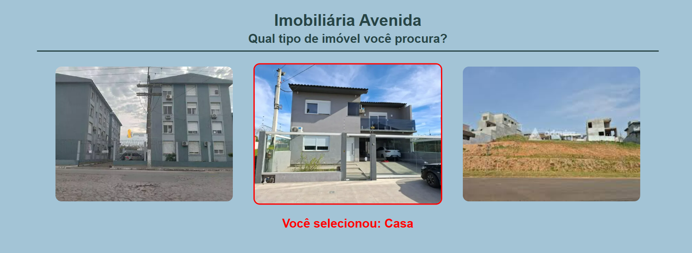

# 🏠 Imobiliária Avenida

Este projeto foi desenvolvido como parte da unidade curricular **Programação Web**, do curso de **Análise e Desenvolvimento de Sistemas - Unisenac Pelotas**.

## 📋 Descrição do Exercício

Criar um projeto React que exiba uma página com o layout de uma imobiliária. O objetivo é permitir que o usuário selecione um tipo de imóvel e que a escolha seja exibida dinamicamente na tela.

### ✅ Requisitos do Exercício

- [✅] Criar um novo projeto em React utilizando Vite.
- [✅] Exibir título e subtítulo.
- [✅] Apresentar 3 imagens de imóveis: apartamento, casa e terreno.
- [✅] Ao clicar em uma imagem, exibir abaixo a escolha do usuário em destaque e na cor vermelha.
- [✅] Estilizar com CSS para uma aparência agradável.
- [✅] Criar `README.md` explicando o projeto.

## 🛠️ Tecnologias Utilizadas

- React
- JavaScript
- HTML5
- CSS3

## 🖼️ Captura de Tela



## 🚀 Como Rodar o Projeto

1. Clone este repositório:
   ```bash
   git clone https://github.com/Elinton-Souza/imobiliaria.git
